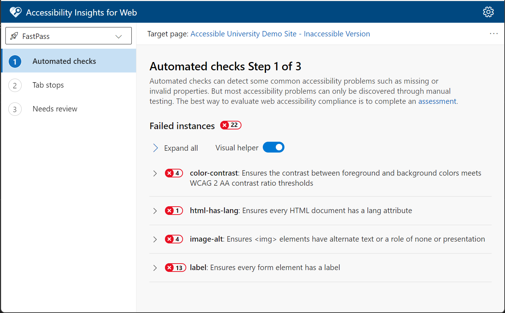

<!--
Copyright (c) Microsoft Corporation. All rights reserved.
Licensed under the MIT License.
-->

## Accessibility Insights for Web Architecture

This document describes the top level architecture for the Accessibility Insights for Web browser extension. It will be helpful to familiarize yourself with some of [the general concepts of browser extensions](https://developer.chrome.com/docs/extensions/mv3/getstarted/extensions-101/) before diving too deeply into this document.

### Extension Contexts

Accessibility Insights for Web runs in several different pages/operating contexts that communicate between one another. The major types of context are:

* The [Details View](#details-view), the main UI page that users interact with
* The [Target Page](#target-page), the page that is being scanned/tested
* The [Popup](#popup), the UI that pops up when selecting the extension icon near the browser address bar
* The [Background Service Worker](#background-service-worker), which coordinates all the shared state for all the other contexts

There may be multiple copies of each type of context at once, except for the Background Service Worker, which there is only one of active at a time.

All of these separate environments behave like a single application, coordinated by the Background Service Worker. They coordinate state with one another using a [Flux design pattern](#flux).

#### Details View

The Details View is the main UI view for Accessibility Insights. It is where FastPass, Quick Assess, and Assessments are all displayed.

Each Details View corresponds to exactly one [Target Page](#target-page) at a time. This mapping is controlled by the `tabId` query parameter that is passed when other extension contexts first open the details view. It is possible for multiple Details Views to be open at a time.

The Details View is implemented in [`/src/DetailsView/`](../src/DetailsView/). Its entry point is [`/src/DetailsView/details-view-initializer.ts`](../src/DetailsView/details-view-initializer.ts).

#### Target Page

A Target Page is a page being tested by the extension. When Accessibility Insights goes to scan a page, it does so by injecting a [Content Script](https://developer.chrome.com/docs/extensions/mv3/content_scripts/) into *each frame* of the Target Page. The Content Script is responsible for running `axe-core` scans and rendering in-page visualizations.

Several Target Pages may have active Content Scripts at a time, and a single Target Page may have multiple active Content Scripts if it uses iframes.

Generally, only the Content Script for a given Target Page's *topmost* frame communicates directly with [Flux messages and stores](#flux) from the Background Service Worker; instructions for child iframes' Content Scripts get passed down from their parent frame's Content Script via the different Frame Messenger components in [`/src/injected/frameCommunicators/`](../src/injected/frameCommunicators/).

The injected Content Script is implemented in [`/src/injected/`](../src/injected/). Its entry point is [`/src/injected/window-initializer.ts`](../src/injected/window-initializer.ts).

#### Popup

The Popup View is an extension page displayed in [a special browser-controlled window](https://developer.chrome.com/docs/extensions/mv3/user_interface/#popup) which appears a user clicks the extension's icon near the browser address bar.

The Popup View is implemented in [`/src/popup/`](../src/popup/). Its entry point is [`/src/popup/popup-init.ts`](../src/popup/popup-init.ts).

#### Background Service Worker

The Background Service Worker (often abbreviated as just "background") is an an [extension service worker](https://developer.chrome.com/docs/extensions/mv3/service_workers/) which acts as the central controller for all of the extension's shared state and different contexts. It is where most "business logic" lives. Unlike all the other contexts, there is only ever one active service worker, no matter how many target pages a user might be working with at a time.

The Background Service Worker is implemented in [`/src/background/`](../src/background). Its entry point is [`/src/background/service-worker-init.ts`](../src/background/service-worker-init.ts).

### Flux

The separate extension contexts communicate via [message passing](https://developer.chrome.com/docs/extensions/mv3/messaging/) with the intention to behave as a singular [flux](https://facebook.github.io/flux/docs/in-depth-overview/) application. At a high level, the flux pattern ensures that data flows in one direction, from an action to a dispatcher (or action creator) to a store and finally to a view (see [flux documentation](https://facebook.github.io/flux/docs/in-depth-overview/#structure-and-data-flow) for more details).

In this repo, message-creators, contained in [the message-creators directory](../src/common/message-creators), use messages to emulate actions. These messages are sent to the background/service worker where they are [distributed](../src/background/background-message-distributor.ts) to the specified context (i.e. a context for the specified tab or depending on the action, the global context). From there, the [interpreter](../src/background/interpreter.ts) will map the  message to an action-creator responsible for invoking the appropriate actions and thus causing stores to update. Once a store is updated, we broadcast the new state to other contexts (i.e. popup, details view, etc.) where a [store-proxy](../src/common/store-proxy.ts), emulating the respective store which was updated, receives the update and is used to populate the view. You can find the top level action interfaces/logic in [the flux directory](../src/common/flux) and stores in [the stores directory](../src/background/stores).

### Storage

Stores are maintained in the Background Service Worker. To ensure that data is not lost on service worker shut down and restart, the extension backs up necessary data in the browser's [IndexedDB](https://developer.mozilla.org/en-US/docs/Web/API/IndexedDB_API), a persistent storage system. The logic for persisting and updating store data can be found in the [persistent-store class](../src/common/flux/persistent-store.ts) and the logic for fetching data on service worker start up can be found in [get-persisted-data](../src/background/get-persisted-data.ts). In addition to any stores that inherit from the persistent-store class, the data stored in the IndexedDB includes a few data structures containing metadata about the state of the extension in case the service worker is shut down while testing is still in progress.

**Note**: Because store data is persisted in the browser across extension runs/updates, it is important to consider backwards compatibility when updating any data structures in the [store-data directory](../src/common/types/store-data).
