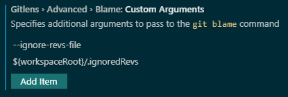

<!--
Copyright (c) Microsoft Corporation. All rights reserved.
Licensed under the MIT License.
-->

## Git blame custom configuration

### Rationale

From time to time, the team decide to got through the repo and do some sort of clean up: update file or class names to match some criteria, massive refactors or change the code styles -think lint and prettier config changes that affect a big portion of the files on the repo, if not all of them.

When this happen, the result of running `git blame` can get "dirty", in the sense of showing commits that may not be intersting to understand the code itself.

One way to avoid this undesirable result is to use `--ignore-revs-file` argument for `git blame` (more info [here](https://git-scm.com/docs/git-blame#Documentation/git-blame.txt---ignore-revs-fileltfilegt)).

### Ignore revs file

All the commits we want git blame to ignore are under `.ignoredRevs` file, directly on the root of the repo

### Setup git (command line)

There seems to be no way to do this "automatically" for every one that clones our repo (according to this [stack overflow](https://stackoverflow.com/questions/18329621/storing-git-config-as-part-of-the-repository#18330114) anyway) so for this each user needs to clone the repo and the add `blame.ignoreRevsFile` option to the local git config. In order to do so, run this on your command line:

```bash
git config --local blame.ignoreRevsFile .ignoredRevs
```

This will add the the proper config under `.git\config` file

### Setup git lens (on vscode)



You can use `--ignore-revs-file` argument for git blame under gitlens configuration.

-   Find `Gitlens > Advanced > Blame: Custom Arguments`
-   Press **Add Item** one time
-   Input `--ignore-revs-file`
-   Press **OK**, this will add the argument name
-   Press **Add Item** one more time
-   Input `${workspace/.ignoredRevs}`
-   Press **OK**, this will add the argument value
-   Restart VSCode for the change to be applied
